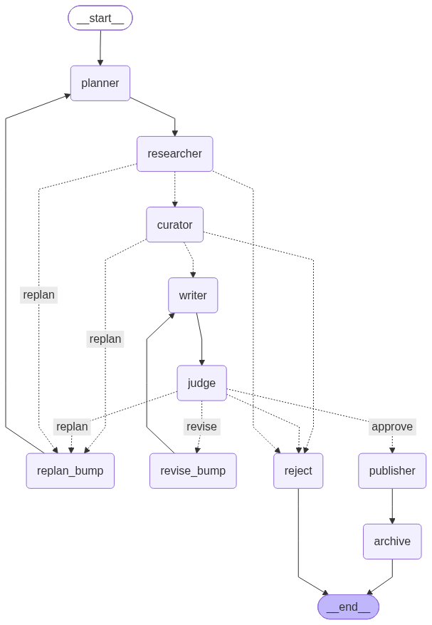

# Trend Scout

Scheduler-ready AI news digest for Telegram, built as a **LangGraph agentic
workflow**. Each daily run researches a configurable date window (seven days by
default), removes duplicate and previously
delivered stories, writes a short Ukrainian digest, validates it, and delivers
it only after the quality gate passes.

Without Telegram credentials the exact same pipeline uses safe preview mode:
it writes rendered Telegram HTML locally and records that nothing was sent or
added to delivered-story memory.

Final project for the robot_dreams **Generative AI Developer** course.

[](https://github.com/RomanMytsko/trend-scout/actions/workflows/ci.yml)
[](https://colab.research.google.com/github/RomanMytsko/trend-scout/blob/main/notebooks/trend_scout_colab.ipynb)

Course artifacts: [presentation PDF](docs/presentation/trend_scout_final_project.pdf) ·
[editable PPTX](docs/presentation/trend_scout_final_project.pptx) ·
[executed notebook](notebooks/trend_scout_colab.ipynb)

## Architecture



```text
  planner ──> researcher ──> curator ──> writer ──> judge ──> publisher ──> archive ──> END
     ^            │             │          ^          │
     └── replan ──┴─────────────┘          └─ revise ─┘
                                                  │
                         budget exhausted / hard fail ──> reject ──> END
```

| Node | Type | Responsibility |
|---|---|---|
| planner | LLM agent | Produce 2–6 queries for the exact configured date window |
| researcher | deterministic worker | RSS + parallel DDG search, URL/semantic dedupe, delivered-memory filter |
| curator | LLM agent | Rank candidates for the audience and remove weak or duplicate picks |
| writer | LLM agent | Produce Markdown in the required digest format and apply feedback |
| judge | guardrail + LLM | URL/format checks, then require every 1–5 rubric score to meet the floor |
| publisher | deterministic worker | Send resumable Telegram HTML chunks or write a local preview |
| archive | memory worker | Remember stories only after confirmed Telegram delivery |
| reject | terminal guardrail | Fail closed and optionally save a blocked preview for review |

There are two bounded feedback loops:

- **replan** when research or topical relevance is too weak;
- **revise** when grounding or format needs correction.

After the configured budgets are exhausted the graph terminates as `blocked`.
It never turns a failed hard guardrail or a below-threshold verdict into an
automatic Telegram post.

## Engineering decisions

- **Typed decision contracts.** Planner, curator and judge use Pydantic
  structured outputs. Writer intentionally returns Markdown, which is checked
  by deterministic format rules and the judge.
- **Source-integrity guardrails.** External fields are escaped before prompt
  rendering; prompts mark them as untrusted; every output URL must come from a
  curated source. These controls reduce prompt-injection impact but are not
  presented as a complete content-security proof.
- **Semantic dedupe.** OpenAI embeddings plus greedy cosine clustering collapse
  cross-outlet versions of the same story.
- **Delivery-aware memory.** Chroma stores idempotent URL records only after a
  successful Telegram response. Preview and failed deliveries are not treated
  as delivered.
- **Resume-safe delivery.** A local journal checkpoints every confirmed
  Telegram chunk. A handled mid-delivery failure resumes from the first
  unconfirmed chunk instead of resending earlier messages.
- **Graceful degradation.** Individual feed, search, embedding and memory
  failures do not crash the entire run. Search queries execute in parallel.
- **Bounded cost.** A clean run uses four chat-model calls. Replanning and two
  revisions can increase the bounded maximum to twelve calls.

## Quickstart

Python 3.10+ is supported. The committed `uv.lock` is the reproducible path:

```bash
git clone https://github.com/RomanMytsko/trend-scout.git
cd trend-scout
uv sync --extra dev
cp .env.example .env  # add OPENAI_API_KEY

uv run trend-scout
uv run trend-scout "vector databases" "RAG evaluation" -o digest.md
```

Standard `venv`/`pip` also works:

```bash
python3 -m venv .venv
.venv/bin/pip install -e '.[dev]'
.venv/bin/trend-scout
```

Only `OPENAI_API_KEY` is required for the pipeline. RSS and DDG search are
keyless. `OPENAI_JUDGE_MODEL` can select an independent judge model; when unset
it uses the writer model.

## Telegram modes

Preview mode is the safe default:

- rendered HTML is saved to `POST_PREVIEW_PATH`;
- `delivery_status=preview` is recorded;
- archive is skipped, because the stories were not delivered.

For real delivery, create a channel, add the bot as an administrator and set:

```dotenv
TELEGRAM_BOT_TOKEN=...
TELEGRAM_CHANNEL_ID=@my_channel
```

Long digests are split between complete rendered lines. No HTML tag or entity
is sliced at Telegram's 4096-character boundary. Confirmed chunks are recorded
in `DELIVERY_JOURNAL_PATH`; retries of the same digest/channel resume safely.

Blocked and failed runs return a non-zero CLI exit code and are never exported
through `--out` as successful digests.

## Scheduling

The repository provides a single idempotent command; the schedule remains an
explicit deployment choice. For example, daily at 08:00:

```cron
0 8 * * * cd /path/to/trend-scout && uv run trend-scout >> digest.log 2>&1
```

The project does not claim that a hosted scheduler or public channel is already
configured. The default rolling seven-day source window is safe for a daily
schedule because confirmed-delivery memory removes stories sent on earlier days.

## Evidence

[`examples/`](examples/) contains:

- a final hardened notebook-run summary (`9/9` code cells, no errors);
- daily and weekly digests from real model runs;
- a daily event trace showing a `3.67 -> 4.67` revision;
- the rendered Telegram preview;
- a forced URL-guardrail demonstration;
- baseline token and cost measurement.

The baseline measurement was 4 LLM calls, 9,971 prompt tokens, 1,554 completion
tokens and approximately `$0.0065` for `gpt-4.1-mini` at the rates encoded in
the measurement script. Revision/replan runs cost more.

## Tests

All tests are offline and make no LLM calls:

```bash
uv run ruff check .
uv run pytest -q
uv build
```

Coverage includes routing budgets, fail-closed behavior, URL/format
guardrails, external-field escaping, dedupe, idempotent memory, delivery-aware
archive behavior and Telegram chunking. The current suite contains 50 offline
tests; CI runs it on Python 3.10 and 3.12.

## Known limitations

- DDG is keyless and can be rate-limited; topic-focused RSS remains the fallback.
- Summaries use titles/snippets, not full article bodies. This limits latency,
  cost and injection surface, but also limits grounding depth.
- Semantic thresholds are empirical and should be calibrated on a labelled
  duplicate/non-duplicate evaluation set.
- Writer and judge use the same model by default. Set `OPENAI_JUDGE_MODEL` to
  reduce self-preference bias.
- Telegram does not expose an exactly-once idempotency key. The journal handles
  normal API failures, but a process crash between Bot API success and the
  local checkpoint can still duplicate that one chunk.
- A real Telegram channel and scheduler require deployment credentials and are
  deliberately not embedded in the repository.

## Project layout

```text
src/trend_scout/
├── config.py     # validated env-driven settings and RSS feeds
├── schemas.py    # Pydantic contracts and LangGraph state
├── sanitize.py   # untrusted-content rendering and hard guardrails
├── tools.py      # RSS and DuckDuckGo workers
├── semantic.py   # embeddings and cosine clustering
├── memory.py     # idempotent delivered-story memory
├── prompts.py    # date-aware prompts
├── nodes.py      # agents, workers and conditional routing
├── graph.py      # LangGraph assembly
├── publisher.py  # Telegram rendering, resumable chunks and delivery status
└── __main__.py   # CLI with fail-closed exit semantics
```
